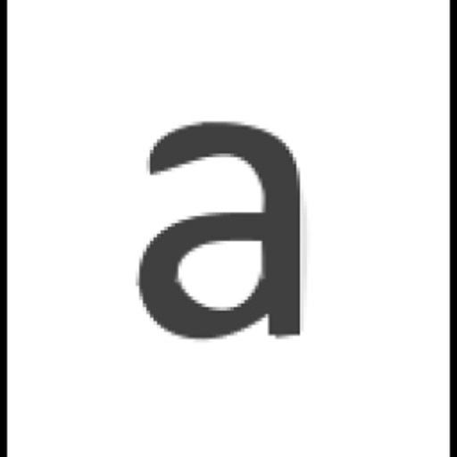

# smoothe-braine

**No folds!**

<!-- [![GitHub release (lastest by date including pre-releases)][releases-shield]][contributors-url] -->

[![Contributors][contributors-shield]][contributors-url]
[![Forks][forks-shield]][forks-url]
[![Stargazers][stars-shield]][stars-url]
[![Issues][issues-shield]][issues-url]
[![MIT License][license-shield]][license-url]
[![LinkedIn][linkedin-shield]][linkedin-url]

<!-- <a href='https://ko-fi.com/afreemanio' target='_blank'> -->

    <a href="https://github.com/afreemanio/smoothe-braine/issues">Report Bug</a>
    <a href="https://github.com/afreemanio/smoothe-braine/issues">Request Feature</a>

## Content

<!-- no toc -->

- [smoothe-braine](#smoothe-braine)
  - [Content](#content)
  - [About The Project](#about-the-project)
    - [Built With](#built-with)
    - [Features](#features)
  - [Contributing](#contributing)
  - [Contact](#contact)
  - [License](#license)

<!-- ABOUT THE PROJECT -->

## About The Project

smoothe-braine

<!-- 

  

     

 -->

### Built With

- [Typescript](https://www.typescriptlang.org/)

### Features

- Real-time Web-RTC!

## Contributing

Sorry! This is a hackathon project - we are **not accepting contributions** at this time.

<!-- CONTACT -->

## Contact

Andrew Freeman - [@afreemanio](https://twitter.com/afreemanio) - andrew@afreeman.io

Project Link: [https://github.com/afreemanio/smoothe-braine](https://github.com/afreemanio/smoothe-braine)

## License

Copyright (c) 2022 Andrew Freeman

Distributed under and usage provided for under the GPL License. See [LICENSE][license-url] for the full details.

<!-- MARKDOWN LINKS & IMAGES -->
<!-- https://www.markdownguide.org/basic-syntax/#reference-style-links -->

[releases-shield]: https://img.shields.io/github/v/release/afreemanio/smoothe-braine?include_prereleases?style=for-the-badge
[contributors-shield]: https://img.shields.io/github/contributors/afreemanio/smoothe-braine.svg?style=for-the-badge
[contributors-url]: https://github.com/afreemanio/smoothe-braine/graphs/contributors
[forks-shield]: https://img.shields.io/github/forks/afreemanio/smoothe-braine.svg?style=for-the-badge
[forks-url]: https://github.com/afreemanio/smoothe-braine/network/members
[stars-shield]: https://img.shields.io/github/stars/afreemanio/smoothe-braine.svg?style=for-the-badge
[stars-url]: https://github.com/afreemanio/smoothe-braine/stargazers
[issues-shield]: https://img.shields.io/github/issues/afreemanio/smoothe-braine.svg?style=for-the-badge
[issues-url]: https://github.com/afreemanio/smoothe-braine/issues
[license-shield]: https://img.shields.io/github/license/afreemanio/smoothe-braine.svg?style=for-the-badge
[license-url]: https://github.com/afreemanio/smoothe-braine/blob/master/LICENSE
[linkedin-shield]: https://img.shields.io/badge/-LinkedIn-black.svg?style=for-the-badge&logo=linkedin&colorB=555
[linkedin-url]: https://linkedin.com/in/afreemanio
